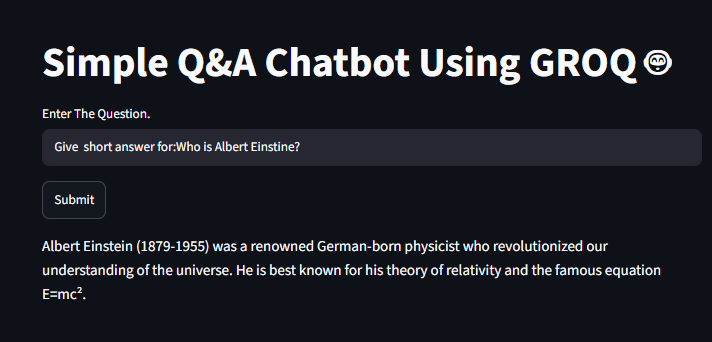
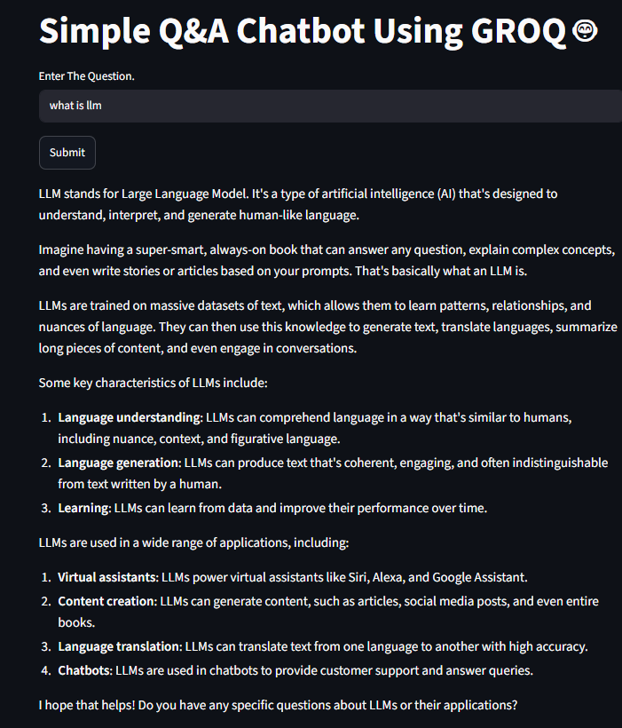

# 🤖 Simple Q&A Chatbot Using GROQ and Streamlit

A simple Question & Answer chatbot built using **Streamlit**, **LangChain**, and **GROQ LLM**. The application takes a user's question as input and generates concise, easy-to-understand answers using the `llama-3.1-8b-instant` model.

---

## 🚀 Features

* Interactive web interface using Streamlit
* Powered by GROQ's fast LLM inference
* Uses LangChain's `ChatPromptTemplate`
* Provides concise and accurate answers
* Beginner-friendly and easy to extend

---

## 🛠️ Technologies Used

* Python
* Streamlit
* LangChain
* GROQ API
* python-dotenv

---

## 📂 Project Structure

```text
.
├── app.py
├── .env
├── requirements.txt
└── README.md
```

---

## ⚙️ Installation

### 1. Clone the Repository

```bash
git clone <your-repository-url>
cd <repository-name>
```

### 2. Create a Virtual Environment

```bash
python -m venv myenv
```

### 3. Activate the Environment

**Windows**

```bash
myenv\Scripts\activate
```

**Linux/macOS**

```bash
source myenv/bin/activate
```

### 4. Install Dependencies

```bash
pip install -r requirements.txt
```

---

## 🔑 Environment Variables

Create a `.env` file in the root directory:

```env
GROQ_API=your_groq_api_key
```

---

## ▶️ Run the Application

```bash
streamlit run app.py
```

The application will open automatically in your browser.

---

## 🧠 How It Works

1. User enters a question in the Streamlit interface.
2. The question is passed to a `ChatPromptTemplate`.
3. The prompt and question are sent to the GROQ LLM.
4. The model generates a response.
5. The answer is displayed on the web interface.

---

## 📸 Example

**Input**

```text
What is Machine Learning?
```

**Output**

```text
Machine Learning is a branch of Artificial Intelligence that enables computers to learn from data and make predictions or decisions without being explicitly programmed.
```

---
## 📸 Screenshots





## 🔮 Future Improvements

* Add chat history
* Streaming responses
* Multiple LLM model selection
* Conversational memory
* RAG (Retrieval-Augmented Generation)
* File upload and document Q&A

---

## 👨‍💻 Author

**Aayush Acharya**

Built as part of my journey in learning LLMs, LangChain, RAG, and Agentic AI.
